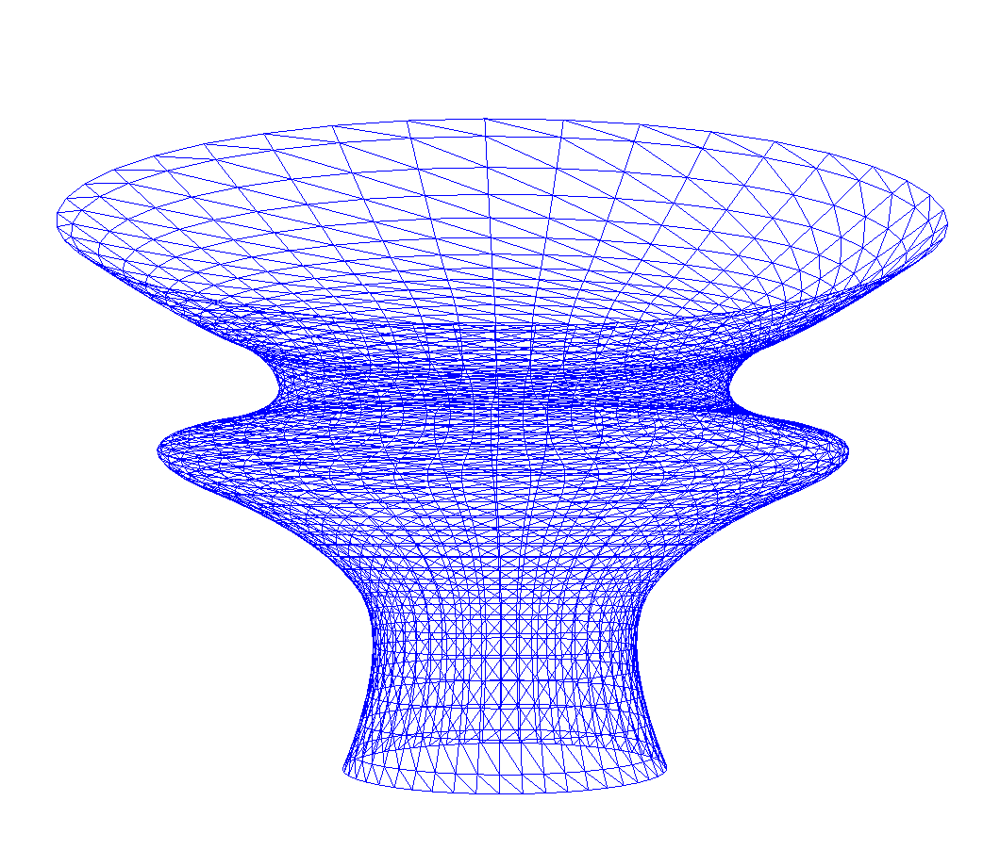

# Curves and Surfaces

Bezier, B-Spline Curves and Surfaces. This assignment requires the creation of Bezier curves and B-Splines in C++ and use them to construct 3D surfaces.

## Keyboard Controls
### Scenes
There are a total of 4 scenes. Use the NUMPAD to switch between scenes.
#### `NUMPAD 1`: 2D Curve Editor
#### `NUMPAD 2`: 3D Curve Viewer
#### `NUMPAD 3`: 3D Surface of Revolution Viewer
#### `NUMPAD 4`: 3D Tensor Surface Viewer

### 2D Curve Editor
#### `E`: Toggle Bezier Curve / B-spline Curve
#### `R`: Reset control points to default example
#### `C`: Clear all control points
######Mouse Input
- Click and drag on points to edit points.
- Click anywhere to create a point.
- Select point by clicking on a point, then right click anywhere to delete the selected point.

### 3D Curve Viewer
#### `E`: Toggle Bezier Curve / B-spline Curve
#### `X`: Reset Camera view

### 3D Surface of Revolution Viewer
#### `Q`: Toggle Wireframe Mode / Solid Mode
#### `X`: Reset Camera view

### 3D Tensor Surface Viewer
#### `Q`: Toggle Wireframe Mode / Solid Mode
#### `↑`: View Tensor Surface 1
#### `↓`: View Tensor Surface 2
#### `X`: Reset Camera view

---
####For all 3D views:
######Mouse Input
- Click and drag anywhere to rotate the camera in the direction of the drag.
######Moving the camera
- Use `W`,`A`,`S`,`D` to move forward, left, backward, and right in the direction of where the camera is facing.
---
## Compiler and Platform
- Compiler: Microsoft C++ Compiler (MSVC 2022)
- Platform: Microsoft Windows 10 Pro (64-bit)
